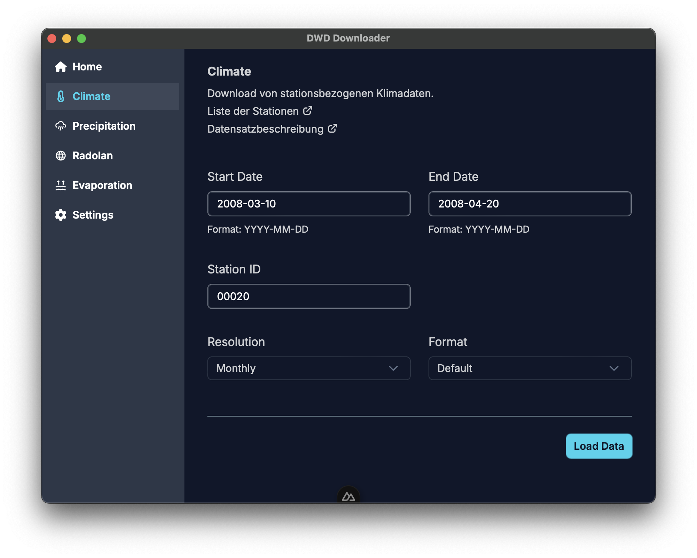

:warning: Actively in Development and currently unstable :warning:

:construction: (testing and fixing in progress) :construction:

# DWD Downloader

A Downloader for some data from the DWD (Deutscher Wetterdienst)

:information_source: This project is **not** affiliated with the DWD

:information_source: This application is developed during employment at the [Universität Rostock](https://www.uni-rostock.de)

# Usage

- Please don't stress the DWD Server, if the app crashes while the download don't try it again until a fix is deployed
- you can set the ENV `DWD_URL` to use for example a local hosted server which contains DWD data
    - default url: https://opendata.dwd.de/

# Supported Products
- [climate / kl](./infos/climate.md)
    - [daily](https://opendata.dwd.de/climate_environment/CDC/observations_germany/climate/daily/kl/)
    - [monthly](https://opendata.dwd.de/climate_environment/CDC/observations_germany/climate/monthly/)
    - [annual](https://opendata.dwd.de/climate_environment/CDC/observations_germany/climate/annual/)
- [precipitation](./infos/precipitation.md)
    - [Min1]()
    - [Min5]()
    - [Min10]()
    - [Hourly]()
- [radolan](./infos/radolan.md)
    - [Min5](https://opendata.dwd.de/climate_environment/CDC/grids_germany/5_minutes/radolan/recent/)
    - [Min5 Reproc2017](https://opendata.dwd.de/climate_environment/CDC/grids_germany/5_minutes/radolan/reproc/2017_002/bin/)
    - [Hourly](https://opendata.dwd.de/climate_environment/CDC/grids_germany/hourly/radolan/)
    - [Hourly Reproc2017](https://opendata.dwd.de/climate_environment/CDC/grids_germany/hourly/radolan/reproc/2017_002/bin/)
    - [Daily](https://opendata.dwd.de/climate_environment/CDC/grids_germany/daily/radolan/)
- [evaporation](./infos/evaporation.md)
    - [DailyP](https://opendata.dwd.de/climate_environment/CDC/grids_germany/daily/evapo_p/)
    - [DailyR](https://opendata.dwd.de/climate_environment/CDC/grids_germany/daily/evapo_r/)
    - [MonthlyP](https://opendata.dwd.de/climate_environment/CDC/grids_germany/monthly/evapo_p/)
    - [MonthlyR](https://opendata.dwd.de/climate_environment/CDC/grids_germany/monthly/evapo_r/)

# Attributions

App Icon: [Cloud download icons created by Stockes Design - Flaticon](https://www.flaticon.com/free-icons/cloud-download)

# Development

WIP

Tech Stack: Backend: [Rust](https://www.rust-lang.org), Frontend: [Nuxt](https://nuxt.com) + [Vue](https://vuejs.org) + [Vite](https://vitejs.dev) + [TS](https://www.typescriptlang.org), the glue: [Tauri](https://tauri.app), UI Lib: [Primevue](https://primevue.org)